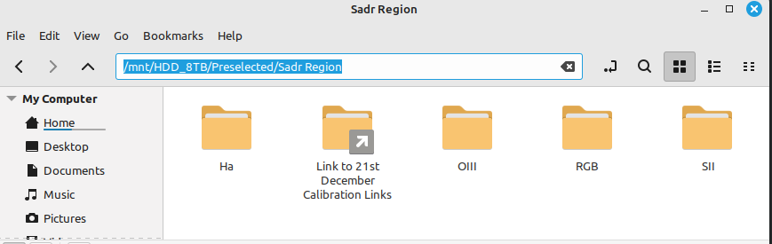
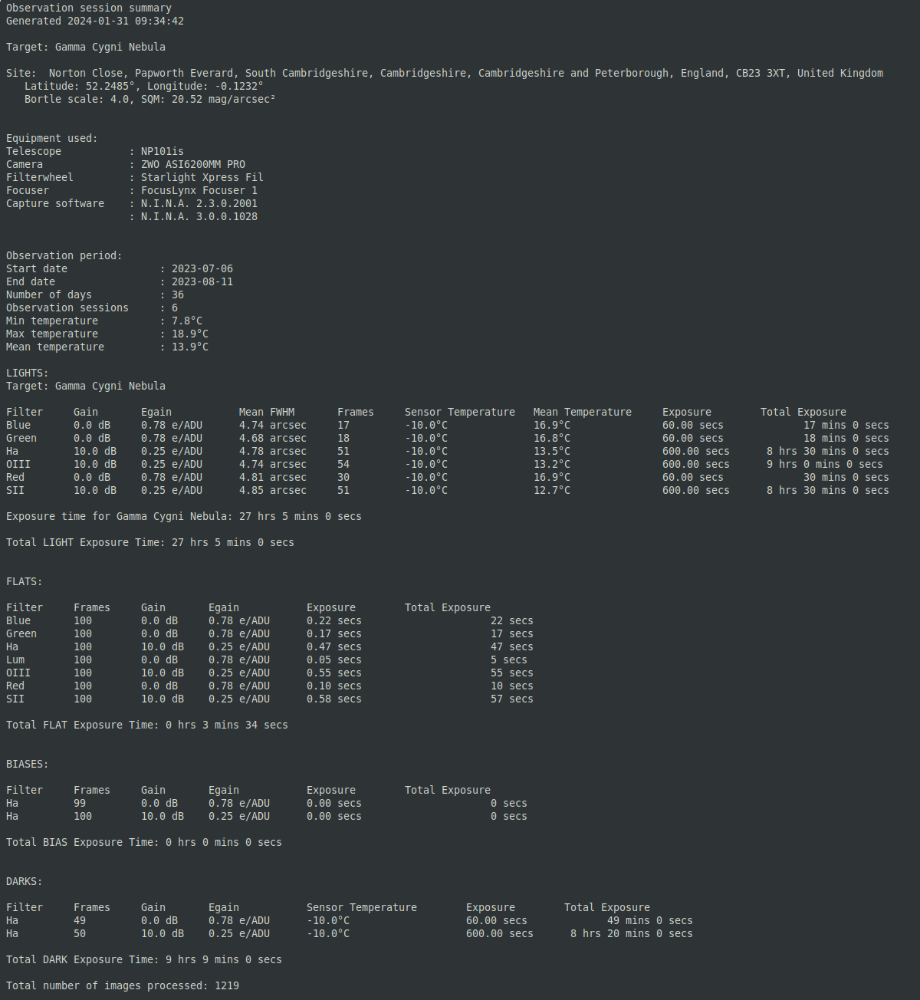
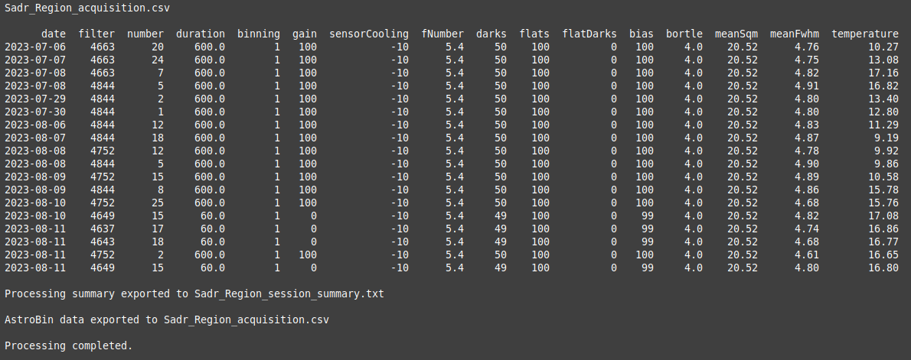
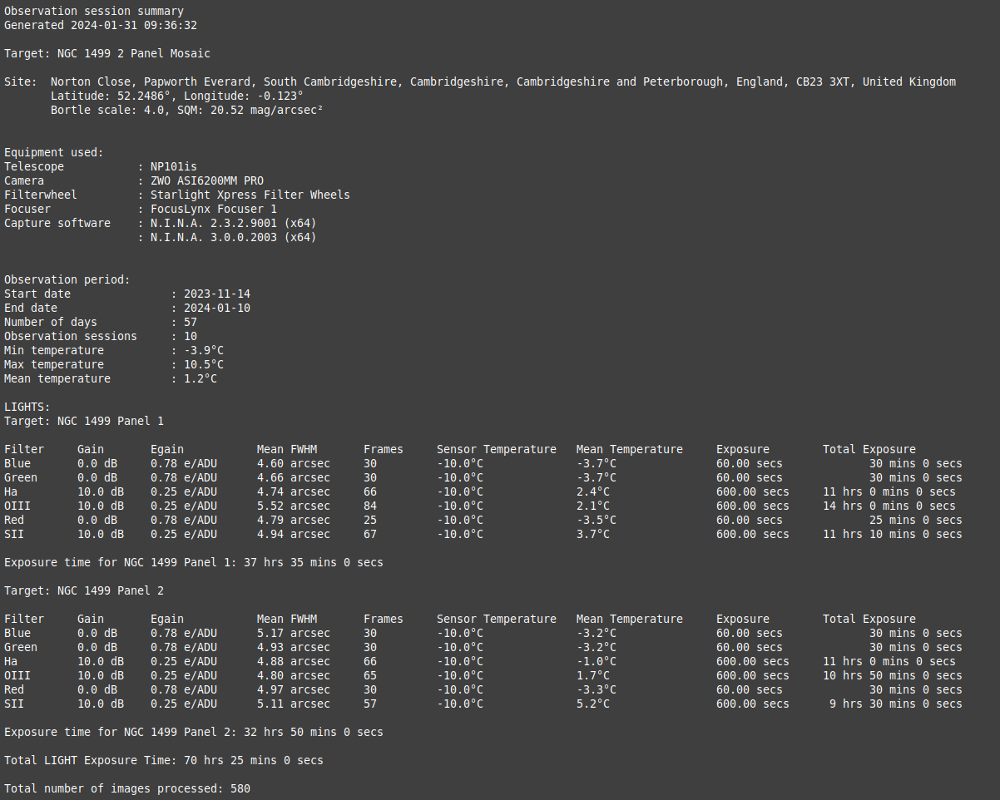
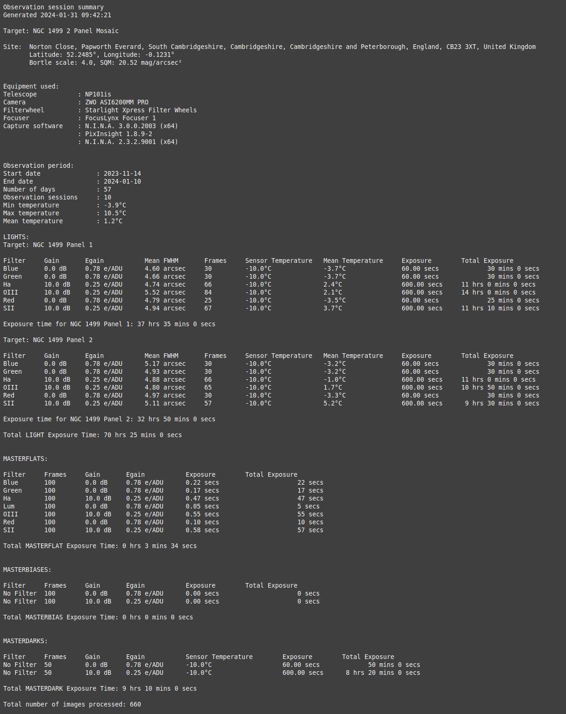

# AstroBin Upload Utility v2.2.1

`astrobin-upload` is a single self-contained executable that reads the FITS and
XISF headers from a directory of astrophotography frames and produces the
acquisition CSV and session summary that [AstroBin](https://www.astrobin.com)'s
bulk import expects.

There is nothing to install: one file, no runtime, no libraries, no build
tools. It runs on Windows, Linux and macOS, on Intel/AMD and ARM.

Usage:
`astrobin-upload [directory_paths] [--config config_file]`

## **Contents**

- [Features](#features)
- [Installing the executable](#installing-the-executable)
- [Creating your config.ini](#creating-your-configini)
- [Using Alternative Configuration Files](#using-alternative-configuration-files)
- [Config.ini contents and editing](#configini-contents-and-editing)
    - [[defaults]](#defaults)
    - [[filters]](#filters)
    - [[secret]](#secret)
    - [[sites]](#sites)
    - [[override]](#override)
    - [[equipmentoverrides]](#equipmentoverrides)
    - [Editing the config.ini](#editing-the-configini)
- [Running the utility](#running-the-utility)
    - [A single directory path or symbolic link](#a-single-directory-path-or-symbolic-link)
    - [Multiple directory paths or symbolic links](#multiple-directory-paths-or-symbolic-links)
    - [Advanced Debugging and Testing](#advanced-debugging-and-testing)
- [Example calls and outputs](#example-calls-and-outputs)
    - [Example 1: Single site, non-mosaic](#example-1-single-site-non-mosaic)
    - [Example 2: Single site, 2 panel mosaic](#example-2-single-site-2-panel-mosaic)
    - [Example 3: Dual site, structured directory](#example-3-dual-site-structured-directory)
    - [Example 4: WBPP two-panel mosaic](#example-4-wbpp-two-panel-mosaic)
- [Troubleshooting](#troubleshooting)
- [References](#references)
    - [AstroBin's Acquisition CSV File Format](#astrobins-acquisition-csv-file-format)
        - [AstroBin Long Exposure Acquisition Fields](#astrobin-long-exposure-acquisition-fields)
    - [Astrobin Filter-Code mappings](#astrobin-filter-code-mappings)
        - [Finding AstroBin's Numeric ID for Filters](#finding-astrobins-numeric-id-for-filters)
    - [Sky quality (Bortle and SQM)](#sky-quality-bortle-and-sqm)
    - [Site names and reverse geocoding](#site-names-and-reverse-geocoding)
    - [FWHM Values](#fwhm-values)
    - [Data Sources](#data-sources)
- [Building from source](#building-from-source)
- [Contributing](#contributing)
- [Contact](#contact)
- [Licence](#licence)

<div style="page-break-after: always;"></div>

## **Features**

When run this utility creates a detailed observation session summary and an acquisition.csv file suitable for upload using AstroBin's import CSV dialogue. 

Data is obtained by extracting FITS (Flexible Image Transport System) or XISF (Extensible Image Serialization Format) headers from image and calibration files associated with the given astronomical target.

Key features include:

- **The ability to pass multiple directories via the command line**: Multiple directories can be passed to the utility via the command line. All images results contained within the directories will be accumulated as part of the target.  

- **Structured and unstructured directories**: Image files, including calibration files, can be collected into a single directory, the root directory. The root directory structure can be flat or contain subdirectories. 

- **Symbolic links to directories**: Symbolic links can be used within the root directory or passed directly via the command line, this is useful when reusing calibration directories. The first directory passed should be the root directory.     

- **MASTER calibration files**: If MASTER calibration files are found, these will be used. If the non-MASTER versions of the MASTER files are also found, the non-MASTER versions will be ignored. 

- **Processing of PixInsight's Weighted Batch Pre-processing (WBPP) output**: When the target is a WBPP directory the utility will use the calibrated LIGHT frames as well as any MASTER calibration files found in the directory. MASTERLIGHT or processed image files are ignored. 

- **Multiple panel mosaic imaging sessions**: Mosaic imaging sessions are detected from the OBJECT entry in the FITS headers. LIGHT frames are processed on a per-panel basis, whilst calibration data is processed per target. For this to work correctly the image names (OBJECT in FITS header) must have the format  

        "target name Panel x"   

    where x is the panel number. N.I.N.A does this automatically but in Sequence Generator Pro the user will have to edit the directory name in Target Settings before starting the sequence.

- **Multiple site support**: Multi-site collaborative target acquisition or remote observatory image capture is supported. Site locations are recognised from the coordinates in the headers: readings are clustered and matched against the `[sites]` section of your `config.ini`. A cluster with no match is looked up online — see [Sky quality (Bortle and SQM)](#sky-quality-bortle-and-sqm) and [Site names and reverse geocoding](#site-names-and-reverse-geocoding) — and the result is saved back to `[sites]`, so a site is looked up once and never again. Data from multiple sites is reported with summary outputs that correctly identify the site contribution, for instance equipment, LIGHT, and calibration data. All data is, however, aggregated in the AstroBin.csv file for the image target.

- **Support for multiple file formats**: Extracts headers for all FITS/FIT/FTS/XISF files in specified directories. Directories can have a mix of files. 

- **Accepts files generated by N.I.N.A, SGPro, ACP, MaximDL and PixInsight** 

- **Sky Quality**: Assigns SQM and Bortle scale classification based on the observation location coordinates, read from the `[sites]` or `[defaults]` section of your `config.ini`. 

- **Auxiliary Parameter Calculation**: Calculates additional parameters like Image Scale (IMSCALE), and Full-width Half Maximum (FWHM) from measured/estimated HFR values for each image. 

- **AstroBin Compatibility**: Formats aggregated data for upload to AstroBin's import CSV file dialogue.

- **Target summary**: Creates a detailed summary text file for a target acquisition session. Caters for single or multi-site data as well as single or mosaic imaging data.

- **Summary files stored in the working directory**: Creates a folder called AstroBinUploadInfo in the current image working directory. Files saved are:

    - ***AstroBinUploader.log***: log file for current session

    - ***acquisition.csv***: session summary in the correct format to copy and paste to AstroBin's import CSV dialogue.

    - ***session_summary.txt***: copy of the detailed session summary that is output to the screen by the utility

    - ***Debug files***: Files created when the --debug switch is used

    The two output files are named after the first directory you passed, with
    spaces replaced by underscores — so `"/mnt/preselected/Sadr Region"`
    produces `Sadr_Region_acquisition.csv` and
    `Sadr_Region_session_summary.txt`.


<div style="page-break-after: always;"></div>

## **Installing the executable**

1. Download the archive for your platform from the
   [releases page](https://github.com/SteveGreaves/AstroBinUploaderRust/releases):

    | Archive | For |
    |---|---|
    | `x86_64-unknown-linux-musl` | Linux, Intel/AMD (statically linked — works on any distribution) |
    | `x86_64-pc-windows-msvc` | Windows, Intel/AMD |
    | `aarch64-pc-windows-msvc` | Windows on ARM |
    | `x86_64-apple-darwin` | macOS, Intel |
    | `aarch64-apple-darwin` | macOS, Apple Silicon (M1 and later) |

2. Extract it. The archive contains the executable, `config.ini.example`,
   this `README.md`, its `images/` folder, and `LICENSE`.

3. Put the executable wherever you like. Adding its folder to your `PATH` lets
   you call `astrobin-upload` from anywhere; otherwise call it by its full path,
   or `./astrobin-upload` from inside its own folder.

**On Linux and macOS**, mark it executable if your extraction tool did not:

    chmod +x astrobin-upload

**On macOS**, the binary is not notarised by Apple, so the first run is blocked.
Either allow it under *System Settings → Privacy & Security* after the first
attempt, or clear the quarantine flag yourself:

    xattr -d com.apple.quarantine ./astrobin-upload

**On Windows**, SmartScreen may warn that the publisher is unrecognised, for the
same reason — the executable is not code-signed. Choose *More info → Run anyway*.

## **Creating your config.ini**

The utility needs a `config.ini`. Run it once with no arguments in the
directory you intend to work from, and it writes a default one and exits:

    astrobin-upload

    A new config.ini file was created. Please edit this before re-running the script.

`config.ini` is looked for in the directory you run the utility *from*, not the
directory the executable lives in. A `config.ini.example` is also supplied in
the archive if you would rather copy it by hand or keep several named
profiles ready to switch between.

If `config.ini` already exists and you run the utility with no directory
argument, it tells you so and exits rather than regenerating over your
edits — give it one or more directories to scan instead. A description of
every parameter in the file is given below. Once you have personalised it,
make a backup.

## **Using Alternative Configuration Files**

You can specify a custom configuration file using the `--config` (or `-c`) flag.

    astrobin-upload "/path/to/my/data" --config my_remote_setup.ini

This is ideal for users who manage different setups (e.g., Mono vs Color, Remote vs Local) and wish to switch profiles without renaming files to `config.ini`. If the specified file does not exist, the utility will report an error and exit.

## **Config.ini contents and editing**
The config.ini file contains the following sections:
### **[defaults]**

The [defaults] section holds: 
1. Default FITS keywords that should be present in the header files and that are needed in the production of the astrobin.csv output file
2. Default site location and auxiliary information, used in the production of the summary.txt output file

The data in the [defaults] section can be modified by the user. If the utility cannot find the information in the header files it will take it from the [defaults] section of the config.ini file

### **[filters]**
The filter section holds the filter name to AstroBin code mappings. The filter names and codes can be modified here.

### **[secret]**
The secret section holds:
1. The sky quality API key and API endpoint required by the utility to obtain values of Bortle and SQM for the site location. Only the API key is to be edited. If there is no valid API key the values of Bortle and SQM are taken from `[defaults][BORTLE]` and `[defaults][SQM]` in the config.ini file.

2. Your email address. This is sent as part of an information string to the reverse geocoding API, which is used to recover the site address. Unique site latitude and longitude values extracted from the headers are passed to the API to generate the site address. Your email address is passed to the API as a courtesy, so the provider can see who is using their API. If the API request fails the site location information is taken from `[defaults][SITE]`, `[defaults][SITELAT]` and `[defaults][SITELONG]` in the config.ini file.

```
[secret]
        #API key        API endpoint
        YOUR_API_KEY = https://www.lightpollutionmap.info/QueryRaster/
        EMAIL_ADDRESS = your_email@example.com
```

The two services contacted are lightpollutionmap.info (sky quality) and
Nominatim / OpenStreetMap (reverse geocoding). TLS and the root certificates
are built into the executable, so no system TLS library or certificate store
is needed on any platform. Every failure mode degrades gracefully — no valid
key, no network, a refused or malformed response — and the run always
completes, falling back to `[defaults]`.

### **[sites]**
The `[sites]` section holds historic site information the utility has found.
When the utility runs it first looks here to collect site information; only
if a site found in the headers does not exist does it access the external
APIs. The utility automatically updates this section if a new site is found.
You do not normally have to edit this section, but a remote site's
information can be added here by hand if the API cannot be reached — copy
the block format shown below and fill in the coordinates your headers
actually carry (`--debug` writes them to `debug_step_00_RawHeaders.csv` if
you need to look them up).

### **[override]**

The [override] section provides a translation layer that allows you to map non-standard FITS keywords to the internal keywords used by the utility. This is particularly useful for capture software or camera drivers that utilize alternative naming conventions for standard parameters. 

Users can maintain their own list of FITS keywords in the `config.ini` under the `[override]` section. This allows for mapping standard internal variables to custom hardware keys provided by specific drivers or devices. The utility also supports a comma-separated list of keys to handle hardware variations (e.g., different versions of the same sensor).

Example:
```ini
[override]
SQM = AOCSKYQ, AOCSKYQU
FOCTEMP = AOCAMBT
```

In this example, the utility will first look for `AOCSKYQ`, and then `AOCSKYQU` if the first is not found, to populate the internal `SQM` variable. The utility prioritizes these manual overrides over standard defaults. Once a mapping is successful, the source hardware column is pruned to ensure a clean data hand-off to the aggregator.

### **[equipmentoverrides]**

New in v2.1.1. Where `[override]` remaps a *keyword* (read `AOCAMBT` and call
it `FOCTEMP`), `[equipmentoverrides]` replaces a *value* — it forces a literal
string into a column for every frame, whatever the header actually said.

The case it exists for: N.I.N.A. writes `EAF` for a ZWO focuser, and you want
the AstroBin summary to say `ZWO EAF`.

```ini
[equipmentoverrides]
        INSTRUME = None
        TELESCOP = None
        FOCNAME = ZWO EAF
        FWHEEL = None
        ROTNAME = None
```

`None` (the generated default) or an empty value means "leave whatever the
header carried". Anything else is forced into that column for every row,
applied immediately after default injection. It works on any column, not just
the five equipment fields the generated template lists.

It is advisable to back up you config.ini file regularly. 

<div style="page-break-after: always;"></div>

## **Editing the config.ini**
A config.ini file with an explanation of the sections is given below:

```
[defaults]
        IMAGETYP = LIGHT
        EXPOSURE = 0.0
        DATE-OBS = 2023-01-01
        XBINNING = 1
```
These are place-holders and are fall backs. These parameters should be created by the capture software.

```
        GAIN = -1
        EGAIN = -1
```
If you have a CCD camera, leave these values as they are. If you have a CMOS camera these gain values can be set to the typical values of your camera. The utility will, however, collect the correct results for both CCD and CMOS cameras from the headers processed. 
```
        INSTRUME = None
        TELESCOP = None
        FOCNAME = None
        FWHEEL = None
        ROTNAME = None
        ROTANTANG = 0
        XPIXSZ = 3.76
        CCD-TEMP = -10
        FOCALLEN = 500
        FOCRATIO = 5.0
```
This is the default equipment configuration. Again the utility should be able to populate these parameters from the header information. XPIXSZ is the X-pixel size in um and is used to represent the sensor pixel size in the utility.
```
        SITE = Unknown Site
        SITELAT = 0.0
        SITELONG = 0.0
        BORTLE = 4
        SQM = 21.0
```
You should modify these parameters to reflect your own site. They are the fallback used whenever a frame's coordinates match no entry in [sites]

<div style="page-break-after: always;"></div>

```
        FILTER = No Filter
```
If you use a color camera and don't report your filters automatically you should enter your filter name here as there may be no filter information in the header.
```
        OBJECT = No target
        FOCTEMP = 20
```
These are place-holders and should not be required as they should be populated by the capture software

```
        HFR = 1.6
```
You should set this value to the typical value for your imaging train. If you use N.I.N.A you can add the measured HFR for the image to the file name. The utility looks for HFR=X.XX in the image file name and if present uses the value found, if HFR is not in the image file name the utility falls back to this value.
```
        SWCREATE = Unknown package
```
This is a place-holder and should not be required, it should be created by the capture software.
```
        USEOBSDATE = True
```
USEOBSDATE, if set to True, aggregates data for the AstroBin acquisition.csv output by each frame's own calendar date. If set to False, frames taken after midnight are counted with the session that started the previous evening. 
```


[filters]
        #Filter     code
        Ha        = 4663
        SII       = 4844
        OIII      = 4752
        Red       = 4649
        Green     = 4643
        Blue      = 4637
        Lum       = 2906

```
Modify the [filters] section to reflect your imaging set up, see [Astrobin Filter-Code mappings](#astrobin-filter-code-mappings) for information on how to populate this table. If you use a color camera and don't report your filters automatically you should enter your filter name and the corresponding code here. Delete filters you don't require.

<div style="page-break-after: always;"></div>


```
[secret]
        #API key        API endpoint
        YOUR_API_KEY = https://www.lightpollutionmap.info/QueryRaster/
        EMAIL_ADDRESS = your_email@example.com
```
If you wish to automatically generate an address and sky quality information
for the observation site, enter the [Sky Quality API key](#sky-quality-bortle-and-sqm)
and your [email address](#site-names-and-reverse-geocoding) here. If you don't
wish to do this, or if the lookup fails, the utility falls back to the site
parameters found in the [defaults] section.

```
[sites]
```
The `[sites]` section is populated automatically by the utility. If a new
site is found it is looked up and added here. You do not normally need to
edit this section.

```
[sites]
        [["Norton Close, Papworth Everard, South Cambridgeshire, Cambridgeshire, Cambridgeshire and Peterborough, England, CB23 3XT, United Kingdom"]]
                latitude = 52.2484
                longitude = -0.1231
                bortle = 4
                sqm = 20.52
```
When the utility processes SITELAT and SITELONG header entries it looks here
first to see if a site has been seen before. If it has, the utility uses the
site information found; if not, it calls the external APIs to retrieve the
information and saves the result here. If the external API call fails, the
utility falls back to the site parameters found in the [defaults] section of
the config.ini file. New sites can also be added by hand, following the
format shown above.

```
[override]

        # Internal Key = Alternative FITS Keyword
        SITE = SITENAME
        EXPOSURE = EXPTIME
        INSTRUME = CAMERA_MODEL
```
The [override] section provides a translation layer that allows you to map non-standard FITS keywords to the internal keywords used by the utility. This is particularly useful for capture software or camera drivers that utilize alternative naming conventions for standard parameters.


## **Running the utility**

The utility is called from the command line. There are two calling methods.

Called with no arguments and no existing `config.ini`, it writes a default
one and exits. See
[Creating your config.ini](#creating-your-configini) for what to edit before
your first real run, and keep a backup once you have personalised it. Called
with no arguments when `config.ini` already exists, it prints a message and
its usage and exits: give it one or more directories to scan.

### **A single directory path or symbolic link**

 Note: only Linux calling examples are used going forward. On Windows the
 command is the same, with `astrobin-upload.exe` in place of
 `astrobin-upload` if you are not calling it through the PATH.

    astrobin-upload "dir 1" 

The utility expects to find all data contained in the directory passed to it. Symbolic links can be used as the argument passed to the utility and can also be present in the directory. The directory leaf or child directory name must be the target name if the output files are to be named correctly. From the processing perspective the only condition required to ensure data is associated with a given target is that all data and links must reside in the one directory.

### **Multiple directory paths or symbolic links** 

    astrobin-upload "dir 1" "dir 2" .... 

All directory arguments are assumed to belong to one target. Again the first directory leaf, or child directory name should contain the target name for the output files to be named correctly.

### **Advanced Debugging and Testing**

Version 2.1.1 and later provide a robust diagnostic system designed for high-precision troubleshooting and workflow verification.

#### **1. Generating Debug Data**
To inspect the internal state of your metadata as it flows through the pipeline, run the utility with the `--debug` flag:

    astrobin-upload "/path/to/my/data" --debug

When enabled, the utility generates a sequence of CSV files in the `AstroBinUploadInfo` directory:
- **`debug_step_00_RawHeaders.csv`**: The exact metadata extracted from your files BEFORE any processing.
- **`debug_step_01_NormalizeHeadersStep.csv`**: Data after hardware overrides and sanitization.
- **`debug_step_04_CalibrationMatcherStep.csv`**: Data after calibration frames have been assigned.
- **`debug_step_06_AggregationStep.csv`**: The final grouped statistics.

#### **2. Using the Diagnostic Test Mode (`--test`)**
The `--test` flag allows you to re-run the entire pipeline using a CSV file instead of scanning your hard drive. This is ideal for verifying configuration changes or reproducing bugs.

**Crucial Note**: Because the test mode injects data at the very beginning of the pipeline, **you must only use files containing raw metadata**. 

**Supported Files for `--test`:**
1.  **`debug_step_00_RawHeaders.csv`**: Use this for standard testing. It is generated every time you run a successful scan with `--debug`.
2.  **`emergency_raw_dump.csv`**: Use this for crash recovery. It is generated automatically if the utility encounters a fatal error during a scan.

**Example Usage:**
    
    astrobin-upload "/path/to/my/data" --test "/path/to/debug_step_00_RawHeaders.csv"

#### **3. Error Handling and Logging**
If the utility encounters a fatal error, it automatically performs an "Emergency Dump":
- The failure is recorded in `AstroBinUploader.log`, naming the pipeline step that failed and the error it raised.
- Whatever metadata was successfully scanned is saved to **`emergency_raw_dump.csv`**. 
- This dump can be fed directly back into the utility using the `--test` flag once the issue is resolved.

The log file also includes a **Horizontal Header Echo**, which prints the full raw metadata dictionary for every file processed (visible when logging level is set to DEBUG).


## **Diagnostic Mode**

The `--test` flag re-runs the whole pipeline from a `.csv` of already-extracted
headers — normally `debug_step_00_RawHeaders.csv`, written into
`AstroBinUploadInfo` by a `--debug` run — instead of scanning the disk. It
produces exactly the same outputs, so a problem can be reproduced without
access to the original FITS data.

    astrobin-upload "/path/to/data" --test debug_step_00_RawHeaders.csv

See [Using the Diagnostic Test Mode](#2-using-the-diagnostic-test-mode---test)
above for the supported files and where the CSV is looked for: a bare filename
is resolved first inside the run's `AstroBinUploadInfo` directory, then at the
path as given.

<div style="page-break-after: always;"></div>

# **Example calls and outputs**

## **Example 1: Single site, non-mosaic** 



### Example 1: Directory structure

    astrobin-upload "/mnt/preselected/Sadr Region"


### Example 1: Script calling syntax

The output files being named:
- Sadr_Region_session_summary.txt
- Sadr_Region_acquisition.csv


<div style="page-break-after: always;"></div>




### Example 1: Summary output

<div style="page-break-after: always;"></div>



### Example 1: AstroBin.csv output


## Example 2: Single site, 2 panel mosaic


### Example 2: Directory structure

    astrobin-upload '/mnt/preselected/NGC 1499 Mosaic'
    
    or using a symbolic link:
    
    astrobin-upload '/home/steve/Desktop/AstroData/Link to NGC 1499 Mosaic'

### Example 2: Script calling syntax

<div style="page-break-after: always;"></div>



### Example 2: Summary Output

<div style="page-break-after: always;"></div>


### Example 2: AstroBin.csv output

## Example 3: Dual site, structured directory

Note: although data is reported on a per-site basis, data is aggregated from all sites to create the AstroBin.csv output. Symbolic links can also be used. A non-structured directory can also be used as long as all files reside under the main target directory. Mosaics can be generated per site, however, summary files can be quite large.


### Example 3: Directory structure


### Example 3: Script calling syntax

    astrobin-upload "/mnt/preselected/AstroBinTest/M51"

<div style="page-break-after: always;"></div>

### Example 3: Summary Output

### Site 1


<div style="page-break-after: always;"></div>

### Site 2


<div style="page-break-after: always;"></div>


### Example 3: AstroBin.csv output

## **Example 4: WBPP two-panel mosaic**


### Example 4: Directory structure

    astrobin-upload "/home/steve/Desktop/Current PixInsight Projects/California Nebula (NGC1499)"

### Example 4: Script calling syntax

<div style="page-break-after: always;"></div>    



### Example 4: Summary Output

<div style="page-break-after: always;"></div>


### Example 4: AstroBin.csv output

<div style="page-break-after: always;"></div>

## **Troubleshooting**

### **The program will not start**

* **"Permission denied" (Linux/macOS)**: the executable bit was lost in
  extraction. `chmod +x astrobin-upload`.
* **macOS refuses to open it**: the binary is not notarised. Allow it under
  *System Settings → Privacy & Security*, or run
  `xattr -d com.apple.quarantine ./astrobin-upload`.
* **Windows SmartScreen warning**: the binary is not code-signed. *More info
  → Run anyway*.
* **"cannot execute binary file"**: wrong architecture. Check you took the
  archive matching your machine — Apple Silicon Macs need `aarch64-apple-darwin`,
  Intel Macs `x86_64-apple-darwin`.

### **"The specified configuration file '...' was not found."**

Only the default `config.ini` is ever generated automatically. If you named a
different file with `--config` and it does not exist, create it yourself —
copy `config.ini.example` or an existing profile, or point `--config` at the
right path.

### **A path starting with `~` is not found**

A quoted `~` is not expanded (`"~/Astro/M31"`). Use `$HOME/Astro/M31`, or
leave the tilde unquoted so the shell expands it before the program sees it.

### **Common FITS/XISF Header Issues**
* **Missing Keywords**: If the utility cannot find specific equipment or location data in your file headers, it will automatically fall back to the values defined in the `[defaults]` section of your `config.ini`.
* **Non-Standard Keywords**: If your capture software uses unique names for standard data, use the `[override]` section in `config.ini` to map them (e.g., mapping `CAMERA_MODEL` to `INSTRUME`).

### **Sky Quality and Site Naming**
* **A new site isn't being looked up online**: check `[secret]` has a real 16-character API key (not the `YOUR_API_KEY` placeholder) and a real `EMAIL_ADDRESS` (not `your_email@example.com`). Without either, or without a network connection, an unmatched site silently falls back to `[defaults]` — the run always completes either way. See [Sky quality](#sky-quality-bortle-and-sqm) and [Site names](#site-names-and-reverse-geocoding) below.
* **Unexpected site name**: site naming is coordinate-clustered. If a session is attributed to the wrong site, check that its `[sites]` latitude and longitude match the frames' headers.

<div style="page-break-after: always;"></div>


# **References**

## **AstroBin's Acquisition CSV File Format**

This section details the required data fields for AstroBin's `acquisition.csv` dialogue.

### **AstroBin Long Exposure Acquisition Fields**

| **Field**        | Description | Validation |
|------------------|-------------|------------|
| **date**         | The date when the acquisition took place | YYYY-MM-DD format |
| **filter**       | Filter used | Numeric ID of a valid filter (found in the URL of the filter's page in the equipment database) |
| **number***      | Number of frames | Whole number |
| **duration***    | Duration of each frame in seconds | Number, Max decimals: 4, Min value: 0.0001, Max value: 999999.9999 |
| **iso**          | ISO setting on the camera | Whole number |
| **binning**      | Binning of pixels | One of [1, 2, 3, 4] |
| **gain**         | Gain setting on the camera | Number, Max decimals: 2 |
| **sensorCooling**| The temperature of the chip in Celsius degrees, e.g., -20 | Whole number, Min value: -274, Max value: 100 |
| **fNumber**      | If a camera lens was used, specify the f-number used for this acquisition session | Number, Max decimals: 2, Min value: 0 |
| **darks**        | The number of dark frames | Whole number, Min value: 0 |
| **flats**        | The number of flat frames | Whole number, Min value: 0 |
| **flatDarks**    | The number of flat dark frames | Whole number, Min value: 0 |
| **bias**         | The number of bias/offset frames | Whole number, Min value: 0 |
| **bortle**       | Bortle dark-sky scale | Whole number, Min value: 1, Max value: 9 |
| **meanSqm**      | Mean SQM mag/arcsec^2 as measured by a Sky Quality Meter | Number, Max decimals: 2, Min value: 0 |
| **meanFwhm**     | Mean Full Width at Half Maximum in arc seconds, a measure of seeing | Number, Max decimals: 2, Min value: 0 |
| **temperature**  | Ambient temperature in Celsius degrees | Number, Max decimals: 2, Min value: -88, Max value: 58 |

## **Astrobin Filter-Code mappings**

The [filters] section of the config.ini file defines the mapping from the filter name to AstroBin's filter code.

The contents of my [filters] section is given below. It shows the names my Astronomik 2 inch filters, as generated by N.I.N.A, and their corresponding AstroBin codes:

[filters]

| **Filter** | **Code** |
|------------|----------|
| Ha         | 4663     |
| SII        | 4844     |
| OIII       | 4752     |
| Red        | 4649     |
| Green      | 4643     |
| Blue       | 4637     |
| Lum        | 2906     |
| CLS        | 4061     |

This is the default filter table in the config.ini. You should edit this section so that it reflects the filters you use. The filter names should match the names the image capture software generates for your filters.

### **Finding AstroBin's Numeric ID for Filters**

The numeric ID of a filter can be found by examining the URL of the filter's page in the [AstroBin equipment database](https://app.astrobin.com/equipment/explorer/filter?page=1).   

For example, consider a [2-inch H-alpha CCD 6nm filter from Astronomik](https://app.astrobin.com/equipment/explorer/filter/4663/astronomik-h-alpha-ccd-6nm-2). By using [AstroBin's filter explorer](https://app.astrobin.com/equipment/explorer/filter?page=1) to navigate to this filter's page the URL is found to be :

https://app.astrobin.com/equipment/explorer/filter/4663/astronomik-h-alpha-ccd-6nm-2

From this URL, the AstroBin code for this Astronomik 2-inch H-alpha CCD 6nm filter is 4663.

## **Sky quality (Bortle and SQM)**

Bortle and SQM come from your `config.ini` — from a matching entry in
`[sites]`, or from `[defaults]` when no site matches. You can fill those in by
hand: look your site up by latitude and longitude at the excellent
<https://www.lightpollutionmap.info> and copy the figures across, or let the
utility do it: with a valid API key and endpoint in `[secret]`, an
unrecognised site is looked up automatically and the result saved to
`[sites]`, so a site is looked up once and never again.

The only `API_ENDPOINT` currently supported is
`https://www.lightpollutionmap.info/QueryRaster/`. You will have to apply to
Jurij Stare, the website owner, for an API key — his email address is
`starej@t-2.net`. A reasonable approach: donate a small amount in support of
his website; he will send a thank-you e-mail, and in response you can ask for
an API key.

`[secret]` section format relating to the sky quality API:

| **API Key** | **API Endpoint**|
| ----------- | --------------- |
| **************** | https://www.lightpollutionmap.info/QueryRaster/ |

If there is no valid key, or the request fails or the network is unreachable,
Bortle and SQM fall back to `[defaults][BORTLE]` and `[defaults][SQM]` — the
run always completes either way.

## **Site names and reverse geocoding**

Site naming works like this:

1. Coordinates from every frame's headers are clustered — readings within
   about 110 m of each other are treated as one physical site, which absorbs
   ordinary GPS drift across sessions.
2. Each cluster's centroid is looked up in `[sites]`. A match supplies that
   site's name, Bortle and SQM.
3. No match is looked up via Nominatim (OpenStreetMap) reverse geocoding, and
   the result is saved back to `[sites]` so it is only ever looked up once.
   If the lookup fails, or `[secret][EMAIL_ADDRESS]` is unset or still the
   `your_email@example.com` placeholder, it falls back to `[defaults]`
   (`SITE`, `SITELAT`, `SITELONG`, `BORTLE`, `SQM`).

Reverse geocoding is required to produce accurate summary information with
multi-site data; without it, all data is aggregated under the default site.
It does not affect the AstroBin.csv output, since that is aggregated across
sites for any target regardless.

`[secret]` section format relating to reverse geocoding:

| **Key** | **Value**|
| ----------- | --------------- |
| EMAIL_ADDRESS | id@provider.com |

Set `EMAIL_ADDRESS` to your own address — it is sent to the API as a courtesy
so the provider can see who is using it, and must be a real address.

The long postal addresses you may already have in `[sites]` were produced by
this same reverse geocoding, on either side — they were never meant to be
typed by hand, though you are free to add or edit an entry yourself using the
block format shown above.

Multi-site sessions therefore still report per-site correctly, provided each
site has an entry in `[sites]`. Add one by hand using the format shown in the
config walkthrough above — a full postal address makes the nicest summary
heading, but any label works.

## **FWHM Values**

The AstroBin Long Exposure Acquisition Fields has an entry for meanFwhm. This is not directly available from the header file. But N.I.N.A allows for the mean HFR value of an image to be embedded in the image file name. An example of my file naming convention, with HFR embedded, is given below:

'NGC 7822_Panel_1_Date_2023-09-02_Time_21-09-01_Filter_Ha_Exposure_600.00s_HFR_1.64px_FrameNo_0002.fits'

The code will look for the keyword HFR in the image file name. If found it will extract the HFR value and assign it to a variable HFR. As HFR is given in pixels, the utility calculates the FWHM from the telescope information held in the FITS header. In particular XPIXSZ the x pixel size in microns and FOCALLEN the telescope focal length in mm.

IMSCALE = XPIXSZ / FOCALLEN * 206.265  
FWHM = 2 * hfr * imscale

The calculations above assume that all stars are circular making FWHM a scaled version of HFR. This is a reasonable approximation as the code averages HFR across all images taken on a particular date with a given filter and gain and then AstroBin further averages HFR across all entries in the uploaded CSV file. Where HFR is not available in the filename it is obtained from [defaults][HFR] in the config.ini file.

## **Data Sources** 
The utility was developed to work with the following sources of image files

1. Night Time Imaging N' Astronomy ([N.I.N.A](https://nighttime-imaging.eu/))

2. Sequence Generator Pro ([SGPro](https://www.sequencegeneratorpro.com/sgpro/))

3. [PixInsight](https://pixinsight.com/) for Master calibration frames

FIT, FITS and FTS headers are read following the card presentation rules of
[Astropy's FITS header library](https://docs.astropy.org/en/stable/io/fits/index.html);
XISF headers are read per the
[PixInsight XISF header specification](https://pixinsight.com/doc/docs/XISF-1.0-spec/XISF-1.0-spec.html#xisf_header).
The header readers are built in, which is what keeps the program a single file.


## **Building from source**

Released binaries cover every common platform, so most users never need this.
If you want to build your own, install a recent stable Rust toolchain from
<https://rustup.rs> and run:

    cargo build --release        # target/release/astrobin-upload
    cargo test                   # the unit-test suite

The only build-time requirement is the Rust toolchain itself — there is no C
library to find or link (the FITS reader is hand-written), which is what lets
the result ship as a single file.

## **Contributing**

This program is intended for educational purposes in the field of
astrophotography. It is part of an open-source project and contributions or
suggestions for improvements are welcome.

To contribute to this project, follow these steps:

1. Fork this repository.
2. Create a branch: `git checkout -b <branch_name>`.
3. Make your changes and commit them: `git commit -m '<commit_message>'`.
4. Push to the original branch: `git push origin <project_name>/<location>`.
5. Create the pull request.

Alternatively, see the GitHub documentation on [creating a pull request](https://docs.github.com/en/github/collaborating-with-issues-and-pull-requests/creating-a-pull-request).

## **Contact**

If you want to contact me, you can reach me at sgreaves139@gmail.com.

## **Licence**

This project uses the following licence: [GNU General Public Licence v3.0](https://github.com/SteveGreaves/AstroBinUploaderRust/blob/main/LICENSE).
