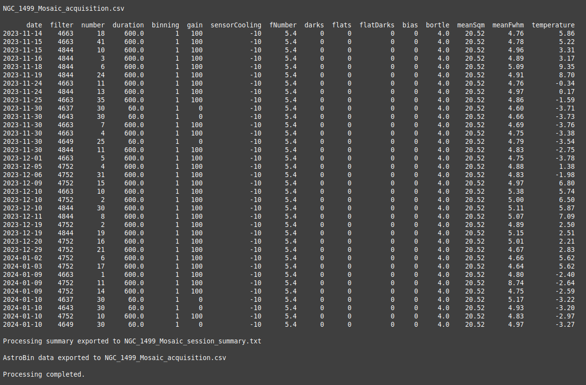
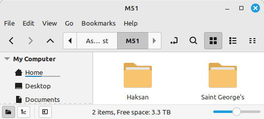
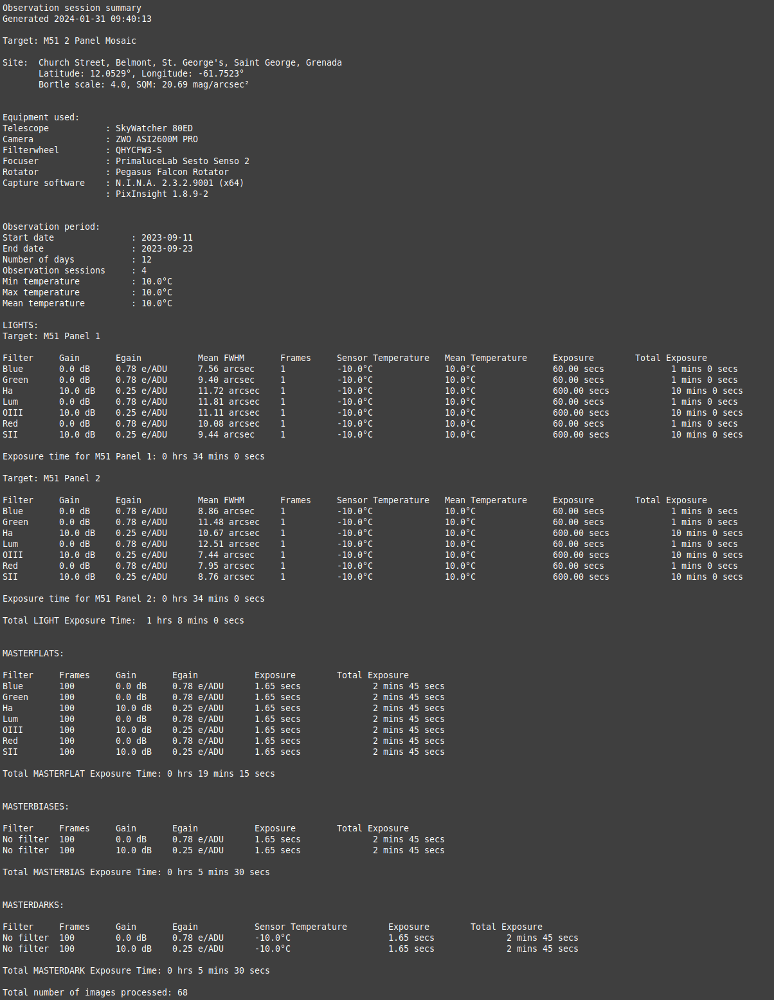
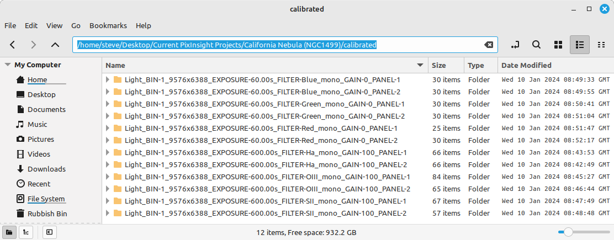
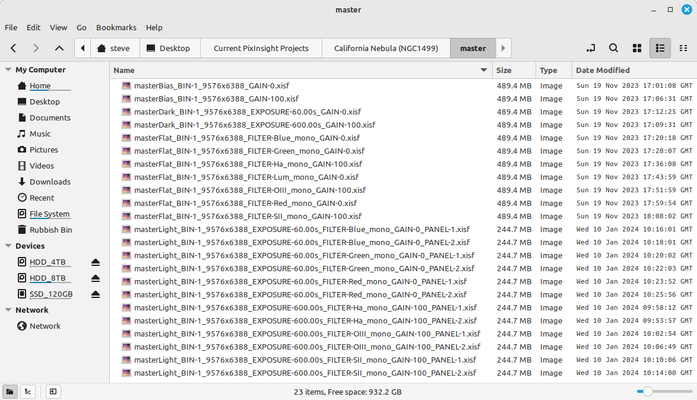

# AstroBin Upload Utility v2.1.3 — Rust edition

A single self-contained executable that processes FITS/XISF headers and creates
the AstroBin data acquisition file and summary text. No Python, no libcfitsio,
no libraries to install.

Usage:
`astrobin-upload [directory_paths] [--config config_file]`

This is a port of [AstroBinUploader](https://github.com/SteveGreaves/AstroBinUploader)
and its output is byte-for-byte identical to that utility at v2.1.3 — the same
CSV, the same summary, to the last digit and trailing space. Everything this
document says about *what the program does* therefore applies to both; the
sections that differ are installation, how you call it, and the handful of
deliberate differences listed under
[Differences from the Python utility](#differences-from-the-python-utility).

## **Contents**

- - [Features](#features)   
- [Prerequisites](#prerequisites)    
    - [Installing the executable](#installing-the-executable)
    - [Creating your config.ini](#creating-your-configini)
    - [Using Alternative Configuration Files](#using-alternative-configuration-files)
    - [Config.ini contents and editing](#configini-contents-and-editing)
        - [[defaults]](#defaults)
        - [[filters]](#filters)
        - [[secrets]](#secrets)
        - [[sites]](#sites)
        - [[override]](#override) 
        - [[equipmentoverrides]](#equipmentoverrides)
        - [Editing the initial config.ini](#editing-the-initial-configini)
- [Differences from the Python utility](#differences-from-the-python-utility)
- [Running the utility](#running-the-utility)
    - [Single directory or symbolic link](#a-single-directory-path-or-symbolic-link-argument-is-passed-to-the-script)
    - [Multiple directory paths or symbolic links](#multiple-directory-paths-or-symbolic-links)
    - [Advanced Debugging and Testing](#advanced-debugging-and-testing)
- [Example calls and outputs](#example-calls-and-outputs)
    - [Example 1: Single site, non-mosaic](#example-1-single-site-non-mosaic-no-masters-data-resides-in-structured-single-directory-symbolic-links-used-for-calibration-data)
    - [Example 2: Single site, 2 panel mosaic](#example-2-single-site-2-panel-mosaic-symbolic-links-to-calibration-data-use-of-masterflats)
    - [Example 3: Dual site, structured directory](#example-3-dual-site-structured-directory-2-panel-mosaic-use-of-mastercals)
    - [Example 4: WBPP two-panel mosaic](#example-4-wbpp-two-panel-mosaic)
- [Troubleshooting](#troubleshooting)
- [References](#references)   
    - [AstroBin's Acquisition CSV File Format](#astrobins-acquisition-csv-file-format)
        - [AstroBin's Long Exposure Acquisition Fields](#astrobin-long-exposure-acquisition-fields)
    - [Astrobin Filter-Code mappings](#astrobin-filter-code-mappings)
        - [Finding the AstroBin's Numeric ID for Filters](#finding-astrobins-numeric-id-for-filters)
    - [Accessing sky quality data](#accessing-sky-quality-data)
    - [Reverse Geocoding](#reverse-geocoding)
    - [FWHM values](#fwhm-values)
    - [Data Sources](#data-sources )
- [Contributing](#contributing)
- [Contact](#contact)
- [Licence](#licence)

<div style="page-break-after: always;"></div>

## **Features**

When run this utility creates a detailed observation session summary and an acquisition.csv file suitable for upload using AstroBin's import CSV dialogue. 

Data is obtained by extracting FITS (Flexible Image Transport System) or XISF (Extensible Image Serialization Format) headers from image and calibration files associated with the given astronomical target.

Key features include:

- **The ability to pass multiple directories via the command line**: Multiple directories can be passed to the utility via the command line. All images results contained within the directories will be accumulated as part of the target.  

- **Structured and unstructured directories**: Image files, including calibration files, can be collected into a single directory, the root directory. The root directory structure can be flat or contain subdirectories. 

- **Symbolic links to directories**: Symbolic links can be used within the root directory or passed directly via the command line, this is useful when reusing calibration directories. The first directory passed should be the root directory.     

- **MASTER calibration files**: If MASTER calibration files are found, these will be used. If the non-MASTER versions of the MASTER files are also found, the non-MASTER versions will be ignored. 

- **Processing of PixInsight's Weighted Batch Pre-processing (WBPP) output**: When the target is a WBPP directory the utility will use the calibrated LIGHT frames as well as any MASTER calibration files found in the directory. MASTERLIGHT or processed image files are ignored. 

- **Multiple panel mosaic imaging sessions**: Mosaic imaging sessions are detected from the OBJECT entry in the FITS headers. LIGHT frames are processed on a per-panel basis, whilst calibration data is processed per target. For this to work correctly the image names (OBJECT in FITS header) must have the format  

        "target name Panel x"   

    where x is the panel number. N.I.N.A does this automatically but in Sequence Generator Pro the user will have to edit the directory name in Target Settings before starting the sequence.

- **Multiple site support**: Multi-site collaborative target acquisition or remote observatory image capture is supported. Site locations are recognised from the coordinates in the headers: readings are clustered and matched against the `[sites]` section of your `config.ini` (no network call is made). Data from multiple sites is reported with summary outputs that correctly identify the site contribution, for instance equipment, LIGHT, and calibration data. All data is, however, aggregated in the AstroBin.csv file for the image target.

- **Support for multiple file formats**: Extracts headers for all FITS/FIT/FTS/XISF files in specified directories. Directories can have a mix of files. 

- **Accepts files generated by N.I.N.A, SGPro, ACP, MaximDL and PixInsight** 

- **Sky Quality**: Assigns SQM and Bortle scale classification based on the observation location coordinates, read from the `[sites]` or `[defaults]` section of your `config.ini`. 

- **Auxiliary Parameter Calculation**: Calculates additional parameters like Image Scale (IMSCALE), and Full-width Half Maximum (FWHM) from measured/estimated HFR values for each image. 

- **AstroBin Compatibility**: Formats aggregated data for upload to AstroBin's import CSV file dialogue.

- **Target summary**: Creates a detailed summary text file for a target acquisition session. Caters for single or multi-site data as well as single or mosaic imaging data.

- **Summary files stored in the working directory**: Creates a folder called AstroBinUploadInfo in the current image working directory. Files saved are:

    - ***AstroBinUploader.log***: log file for current session

    - ***acquisition.csv***: session summary in the correct format to copy and paste to AstroBin's import CSV dialogue.

    - ***session_summary.txt***: copy of the detailed session summary that is output to the screen by the utility

    - ***Debug files***: Files created when the --debug switch is used

    The two output files are named after the first directory you passed, with
    spaces replaced by underscores — so `"/mnt/preselected/Sadr Region"`
    produces `Sadr_Region_acquisition.csv` and
    `Sadr_Region_session_summary.txt`.


<div style="page-break-after: always;"></div>

# **Differences from the Python utility**

Everything this program *produces* is byte-for-byte identical to
AstroBinUploader v2.2.0 **run offline**: the acquisition CSV, the session
summary, the `debug_step_*.csv` files, and the console output. That is checked
automatically, on every change, by running both programs side by side and
comparing the results byte for byte.

"Run offline" is the one qualification that matters, and it is the first row
of the table below. The Python utility's v2.2.0 restored the ability to look
an unknown observing site up online; this port has no network code and does
not. Given the same `config.ini` **without** a `[secret]` section — which is
how the comparison corpus is configured — the two agree exactly. Given a
`[secret]` section, the Python utility can name a site this port would leave
as the `[defaults]` value.

The differences are these, and they are all deliberate.

| | Python utility | This edition |
|---|---|---|
| **Unknown observing site** | With `[secret]`, looks the coordinates up online (OpenStreetMap for the address, lightpollutionmap.info for Bortle/SQM) and saves the result to `[sites]` | No network code at all; `[secret]` is ignored and `[defaults]` is used. Run the Python utility once to add a new site |
| **Installing** | Python 3.x, then `pip install -r requirements.txt` | Nothing. One executable. |
| **Calling it** | `astrobin-upload "dir"` | `astrobin-upload "dir"` |
| **First run** | Called with no arguments, writes a default `config.ini` and exits | Copy `config.ini.example` to `config.ini` yourself; a missing config is an error |
| **`~` in a path** | Expanded by the program, so `"~/Astro/M31"` works quoted | Left to the shell; use `$HOME/Astro/M31` or an unquoted `~` |
| **Log: the command line** | `Calling function and arguments provided:` names `AstroBinUpload.py` | Names the executable. Nothing else can be true of a compiled program |
| **Log: a fatal error** | A full Python traceback | The failing step and its error message |

The log file itself deserves a word. It is written to the same place, in the
same format, with the same records in the same order — and the
`funcName`/`Line:` fields still name the Python function and line each record
came from, because that is what a reader comparing the two logs expects to
see. Only the timestamps differ, and those differ between two runs of the
Python utility as well.

Two of the Python program's records have no counterpart here and are never
written: the one announcing that a default `config.ini` has been generated
(this edition does not generate one), and one reporting a coordinate-alignment
failure that this edition's alignment cannot suffer. The other 83 are all
present.

### About the screenshots

The screenshots throughout this document were captured from the Python
utility. They are reproduced here unchanged because the output is identical —
what you see on screen and in the files is what this edition produces.

## **Pre-requisites**

None. This edition is a single self-contained executable — there is no Python
to install, no `pip`, no libraries and no shared-library dependencies. It runs
on Windows, Linux and macOS, on both Intel/AMD and ARM processors.

### **Installing the executable**

1. Download the archive for your platform from the
   [releases page](https://github.com/SteveGreaves/AstroBinUploaderRust/releases):

    | Archive | For |
    |---|---|
    | `x86_64-unknown-linux-musl` | Linux, Intel/AMD (statically linked — works on any distribution) |
    | `x86_64-pc-windows-msvc` | Windows, Intel/AMD |
    | `aarch64-pc-windows-msvc` | Windows on ARM |
    | `x86_64-apple-darwin` | macOS, Intel |
    | `aarch64-apple-darwin` | macOS, Apple Silicon (M1 and later) |

2. Extract it. The archive contains the executable, `config.ini.example`,
   this `README.md`, its `images/` folder, and `LICENSE`.

3. Put the executable wherever you like. Adding its folder to your `PATH` lets
   you call `astrobin-upload` from anywhere; otherwise call it by its full path,
   or `./astrobin-upload` from inside its own folder.

**On Linux and macOS**, mark it executable if your extraction tool did not:

    chmod +x astrobin-upload

**On macOS**, the binary is not notarised by Apple, so the first run is blocked.
Either allow it under *System Settings → Privacy & Security* after the first
attempt, or clear the quarantine flag yourself:

    xattr -d com.apple.quarantine ./astrobin-upload

**On Windows**, SmartScreen may warn that the publisher is unrecognised, for the
same reason — the executable is not code-signed. Choose *More info → Run anyway*.

### **Creating your config.ini**

The utility needs a `config.ini` and **will not create one for you** — this is
the one place where it deliberately behaves differently from the Python
original, which generates a default file on its first run. Instead, a
`config.ini.example` is supplied in the archive.

Copy it, then edit your copy:

    cp config.ini.example config.ini        # Linux / macOS
    copy config.ini.example config.ini      # Windows

`config.ini` is looked for in the directory you run the utility *from*, not the
directory the executable lives in. If it is missing, the utility reports

        Error: configuration file not found: config.ini

and stops, rather than guessing at defaults that would quietly produce wrong
acquisition data. A description of every parameter in the file is given below.
Once you have personalised it, make a backup.

### **Using Alternative Configuration Files**

You can specify a custom configuration file using the `--config` (or `-c`) flag.

    astrobin-upload "/path/to/my/data" --config my_remote_setup.ini

This is ideal for users who manage different setups (e.g., Mono vs Color, Remote vs Local) and wish to switch profiles without renaming files to `config.ini`. If the specified file does not exist, the utility will report an error and exit.

### **Config.ini contents and editing**
The config.ini file contains the following sections:
### **[defaults]**

The [defaults] section holds: 
1. Default FITS keywords that should be present in the header files and that are needed in the production of the astrobin.csv output file
2. Default site location and auxiliary information, used in the production of the summary.txt output file

The data in the [defaults] section can be modified by the user. If the utility cannot find the information in the header files it will take it from the [defaults] section of the config.ini file

### **[filters]**
The filter section holds the filter name to AstroBin code mappings. The filter names and codes can be modified here.

### **[secrets]** — removed in v2.1.0

**This section is no longer used and can be deleted from your `config.ini`.**

Earlier versions called two external APIs: lightpollutionmap.info for Bortle
and SQM, and Nominatim reverse geocoding for the site address. Neither is
called any more — the utility is fully offline. Site information now comes
from the `[sites]` section (matched by coordinate), falling back to
`[defaults]` (`SITE`, `SITELAT`, `SITELONG`, `BORTLE`, `SQM`) when no site
matches. Nothing reads an API key or an email address, so leaving the old
section in place is harmless but pointless.

### **[sites]**
The `[sites]` section is your own list of known observing sites. The utility
clusters the GPS coordinates found in your headers (drifting readings within
about 110 m are treated as one site) and looks the resulting position up here.
A match supplies the site's name, Bortle and SQM; no match falls back to
`[defaults]`.

**You maintain this section yourself.** Earlier versions appended new sites
automatically after a reverse-geocoding call; since v2.1.0 there are no API
calls, so add a site by copying the block format shown below and filling in
the coordinates your headers actually carry (`--debug` writes them to
`debug_step_00_RawHeaders.csv` if you need to look them up).

### **[override]**

The [override] section provides a translation layer that allows you to map non-standard FITS keywords to the internal keywords used by the utility. This is particularly useful for capture software or camera drivers that utilize alternative naming conventions for standard parameters. 

Users can maintain their own list of FITS keywords in the `config.ini` under the `[override]` section. This allows for mapping standard internal variables to custom hardware keys provided by specific drivers or devices. The utility also supports a comma-separated list of keys to handle hardware variations (e.g., different versions of the same sensor).

Example:
```ini
[override]
SQM = AOCSKYQ, AOCSKYQU
FOCTEMP = AOCAMBT
```

In this example, the utility will first look for `AOCSKYQ`, and then `AOCSKYQU` if the first is not found, to populate the internal `SQM` variable. The utility prioritizes these manual overrides over standard defaults. Once a mapping is successful, the source hardware column is pruned to ensure a clean data hand-off to the aggregator.

### **[equipmentoverrides]**

New in v2.1.1. Where `[override]` remaps a *keyword* (read `AOCAMBT` and call
it `FOCTEMP`), `[equipmentoverrides]` replaces a *value* — it forces a literal
string into a column for every frame, whatever the header actually said.

The case it exists for: N.I.N.A. writes `EAF` for a ZWO focuser, and you want
the AstroBin summary to say `ZWO EAF`.

```ini
[equipmentoverrides]
        INSTRUME = None
        TELESCOP = None
        FOCNAME = ZWO EAF
        FWHEEL = None
        ROTNAME = None
```

`None` (the generated default) or an empty value means "leave whatever the
header carried". Anything else is forced into that column for every row,
applied immediately after default injection. It works on any column, not just
the five equipment fields the generated template lists.

It is advisable to back up you config.ini file regularly. 

<div style="page-break-after: always;"></div>

## **Editing the config.ini**
A config.ini file with an explanation of the sections is given below:

```
[defaults]
        IMAGETYP = LIGHT
        EXPOSURE = 0
        DATE-OBS = 2023-01-01
        XBINNING = 1
```
These are place-holders and are fall backs. These parameters should be created by the capture software.

```
        GAIN = -1
        EGAIN = -1
```
If you have a CCD camera, leave these values as they are. If you have a CMOS camera these gain values can be set to the typical values of your camera. The utility will, however, collect the correct results for both CCD and CMOS cameras from the headers processed. 
```
        INSTRUME = None
        TELESCOP = None
        FOCNAME = None
        FWHEEL = None
        ROTNAME = None
        ROTANTANG = 0
        XPIXSZ = 3
        CCD-TEMP = -10
        FOCALLEN = 540
        FOCRATIO = 5
```
This is where default the equipment configuration. Again the utility should be able to populate these parameters from the header information. XPIXSZ is the X-pixel size in um and is used to represent the sensor pixel size in the utility.
```
        SITE = My Site Name
        SITELAT = 0.0000
        SITELONG = 0.0000
        BORTLE = 4
        SQM = 21
```
You should modify these parameters to reflect your own site. They are the fallback used whenever a frame's coordinates match no entry in [sites]

<div style="page-break-after: always;"></div>

```
        FILTER = No Filter
```
If you use a color camera and don't report your filters automatically you should enter your filter name here as there may be no filter information in the header.
```
        OBJECT = No target
        FOCTEMP = 20
```
These are place-holders and should not be required as they should be populated by the capture software

```
        HFR = 1
```
You should set this value to the typical value for your imaging train. If you use N.I.N.A you can add the measured HFR for the image to the file name. The utility looks for HFR=X.XX in the image file name and if present uses the value found, if HFR is not in the image file name the utility falls back to this value.
```
        SWCREATE = Unknown package
```
This is a place-holder and should not be required, it should be created by the capture software.
```
        USEOBSDATE = False
```
USEOBSDATE if set to True the actual date of the observation session is used when aggregating data for the astrobin acqusition.csv output. If this prameter is set to False then, per session, the date the observation session was started is used. 
```


[filters]
        #Filter     code
        Ha        = 4663
        SII       = 4844
        OIII      = 4752
        Red       = 4649
        Green     = 4643
        Blue      = 4637
        Lum       = 2906

```
Modify the [filters] section to reflect your imaging set up, see [Astrobin Filter-Code mappings](#astrobin-filter-code-mappings) for information on how to populate this table. If you use a color camera and don't report your filters automatically you should enter your filter name and the corresponding code here. Delete filters you don't require.

<div style="page-break-after: always;"></div>


A `[secret]` section appears in configs generated by v2.0.x and earlier. It
held a sky-quality API key and an email address for reverse geocoding. **It is
no longer read** — since v2.1.0 the utility makes no network calls at all —
and can be deleted.

```
[sites]
```
Site information comes from the `[sites]` section, which you maintain by hand
(earlier versions appended to it automatically after a geocoding call). A site
block looks like this — the coordinates are matched against the clustered
positions found in your headers:

```
[sites]
        [["My Full Site Address, Country, Postcode"]]
                latitude = 0.0000
                longitude = 0.0000
                bortle = 4
                sqm = 21
```
When the utility processes [SITELAT] and [SITELONG] header entries it looks here to see whether the position matches a site you have listed. If it does, the site's name, Bortle and SQM are used. If it does not, the utility falls back to the site parameters found in the [defaults] section of the config.ini file. New sites are added by hand in the [sites] section, following the format shown above.

```
[override]

        # Internal Key = Alternative FITS Keyword
        SITE = SITENAME
        EXPOSURE = EXPTIME
        INSTRUME = CAMERA_MODEL
```
The [override] section provides a translation layer that allows you to map non-standard FITS keywords to the internal keywords used by the utility. This is particularly useful for capture software or camera drivers that utilize alternative naming conventions for standard parameters.


## **Running the utility**

The utility is called from the command line. There are two calling methods.

Called with no arguments it prints its usage and exits — unlike the Python
utility, it does not generate a `config.ini` for you. Copy
`config.ini.example` to `config.ini` yourself, as described in
[Creating your config.ini](#creating-your-configini), and keep a backup once
you have personalised it.

### **A single directory path or symbolic link**

 Note: only Linux calling examples are used going forward. On Windows the
 command is the same, with `astrobin-upload.exe` in place of
 `astrobin-upload` if you are not calling it through the PATH.

    astrobin-upload "dir 1" 

The utility expects to find all data contained in the directory passed to it. Symbolic links can be used as the argument passed to the utility and can also be present in the directory. The directory leaf or child directory name must be the target name if the output files are to be named correctly. From the processing perspective the only condition required to ensure data is associated with a given target is that all data and links must reside in the one directory.

### **Multiple directory paths or symbolic links** 

    astrobin-upload "dir 1" "dir 2" .... 

All directory arguments are assumed to belong to one target. Again the first directory leaf, or child directory name should contain the target name for the output files to be named correctly.

### **Advanced Debugging and Testing**

Version 2.1.1 and later provide a robust diagnostic system designed for high-precision troubleshooting and workflow verification.

#### **1. Generating Debug Data**
To inspect the internal state of your metadata as it flows through the pipeline, run the utility with the `--debug` flag:

    astrobin-upload "/path/to/my/data" --debug

When enabled, the utility generates a sequence of CSV files in the `AstroBinUploadInfo` directory:
- **`debug_step_00_RawHeaders.csv`**: The exact metadata extracted from your files BEFORE any processing.
- **`debug_step_01_NormalizeHeadersStep.csv`**: Data after hardware overrides and sanitization.
- **`debug_step_04_CalibrationMatcherStep.csv`**: Data after calibration frames have been assigned.
- **`debug_step_06_AggregationStep.csv`**: The final grouped statistics.

#### **2. Using the Diagnostic Test Mode (`--test`)**
The `--test` flag allows you to re-run the entire pipeline using a CSV file instead of scanning your hard drive. This is ideal for verifying configuration changes or reproducing bugs.

**Crucial Note**: Because the test mode injects data at the very beginning of the pipeline, **you must only use files containing raw metadata**. 

**Supported Files for `--test`:**
1.  **`debug_step_00_RawHeaders.csv`**: Use this for standard testing. It is generated every time you run a successful scan with `--debug`.
2.  **`emergency_raw_dump.csv`**: Use this for crash recovery. It is generated automatically if the utility encounters a fatal error during a scan.

**Example Usage:**
    
    astrobin-upload "/path/to/my/data" --test "/path/to/debug_step_00_RawHeaders.csv"

#### **3. Error Handling and Logging**
If the utility encounters a fatal error, it automatically performs an "Emergency Dump":
- The failure is recorded in `AstroBinUploader.log`, naming the pipeline step that failed and the error it raised. (The Python utility records a full Python traceback here; this edition records the error message.)
- Whatever metadata was successfully scanned is saved to **`emergency_raw_dump.csv`**. 
- This dump can be fed directly back into the utility using the `--test` flag once the issue is resolved.

The log file also includes a **Horizontal Header Echo**, which prints the full raw metadata dictionary for every file processed (visible when logging level is set to DEBUG).


## **Diagnostic Mode**

The `--test` flag allows developers and users to troubleshoot issues using a `.csv` file (typically `basic_headers.csv` generated via the `--debug` run) without needing access to the raw FITS data. This ensures consistent logic verification across different environments.

Example usage:
`astrobin-upload "/path/to/data" --test "basic_headers.csv"`

**Note:** The CSV file must reside within the first directory provided in the command line arguments.
<div style="page-break-after: always;"></div>

# **Example calls and outputs**

## **Example 1: Single site, non-mosaic** 


### Example 1: Directory structure

    astrobin-upload "/mnt/preselected/Sadr Region"


### Example 1: Script calling syntax

The output files being named:     
- Sadr_Region_session_summary.txt
- Sadr_Region_aquisition.csv  


<div style="page-break-after: always;"></div>


### Example 1: Summary output

<div style="page-break-after: always;"></div>


### Example 1: AstroBin.csv output


## Example 2: Single site, 2 panel mosaic


### Example 2: Directory structure

    astrobin-upload '/mnt/preselected/NGC 1499 Mosaic'
    
    or using a symbolic link:
    
    astrobin-upload '/home/steve/Desktop/AstroData/Link to NGC 1499 Mosaic'

### Example 2: Script calling syntax

<div style="page-break-after: always;"></div>


### Example 2: Summary Output

<div style="page-break-after: always;"></div>



### Example 2: AstroBin.csv output

## Example 3: Dual site, structured directory

Note: although data is reported on a per-site basis, data is aggregated from all sites to create the AstroBin.csv output. Symbolic links can also be used. A non-structured directory can also be used as long as all files reside under the main target directory. Mosaics can be generated per site, however, summary files can be quite large.



### Example 3: Directory structure


### Example 3: Script calling syntax

    astrobin-upload "/mnt/preselected/AstroBinTest/M51"

<div style="page-break-after: always;"></div>

### Example 3: Summary Output

### Site 1



<div style="page-break-after: always;"></div>

### Site 2


<div style="page-break-after: always;"></div>


### Example 3: AstroBin.csv output

## **Example 4: WBPP two-panel mosaic**






### Example 4: Directory structure

    astrobin-upload "/home/steve/Desktop/Current PixInsight Projects/California Nebula (NGC1499)"

### Example 4: Script calling syntax

<div style="page-break-after: always;"></div>    


### Example 4: Summary Output

<div style="page-break-after: always;"></div>


### Example 4: AstroBin.csv output

<div style="page-break-after: always;"></div>

## **Troubleshooting**

### **The program will not start**

There is nothing to install, so `ModuleNotFoundError` and `pip` problems
cannot occur. What can:

* **"Permission denied" (Linux/macOS)**: the executable bit was lost in
  extraction. `chmod +x astrobin-upload`.
* **macOS refuses to open it**: the binary is not notarised. Allow it under
  *System Settings → Privacy & Security*, or run
  `xattr -d com.apple.quarantine ./astrobin-upload`.
* **Windows SmartScreen warning**: the binary is not code-signed. *More info
  → Run anyway*.
* **"cannot execute binary file"**: wrong architecture. Check you took the
  archive matching your machine — Apple Silicon Macs need `aarch64-apple-darwin`,
  Intel Macs `x86_64-apple-darwin`.

### **"configuration file not found: config.ini"**

The utility does not create one. Copy `config.ini.example` to `config.ini` in
the directory you are running from, or point at one with `--config`.

### **A path starting with `~` is not found**

Quote-protected tildes are not expanded by this edition (`"~/Astro/M31"`).
Use `$HOME/Astro/M31`, or leave the tilde unquoted so the shell expands it.

### **Common FITS/XISF Header Issues**
* **Missing Keywords**: If the utility cannot find specific equipment or location data in your file headers, it will automatically fall back to the values defined in the `[defaults]` section of your `config.ini`.
* **Non-Standard Keywords**: If your capture software uses unique names for standard data, use the `[override]` section in `config.ini` to map them (e.g., mapping `CAMERA_MODEL` to `INSTRUME`).

### **Sky Quality and Site Naming**
* **No network calls**: this port contacts no external service. Bortle, SQM and the site name come from a matching `[sites]` entry, or from `[defaults]` when no site matches. The Python utility can also look an unknown site up online (restored in its v2.2.0); this port does not — see [Differences from the Python utility](#differences-from-the-python-utility). See [Sky quality](#sky-quality-bortle-and-sqm) and [Site names](#site-names-and-reverse-geocoding) below.
* **Unexpected site name**: site naming is local and coordinate-clustered. If a session is attributed to the wrong site, check that its `[sites]` latitude and longitude match the frames' headers.

<div style="page-break-after: always;"></div>


# **References**

## **AstroBin's Acquisition CSV File Format**

This section details the required data fields for AstroBin's `acquisition.csv` dialogue.

### **AstroBin Long Exposure Acquisition Fields**

| **Field**        | Description | Validation |
|------------------|-------------|------------|
| **date**         | The date when the acquisition took place | YYYY-MM-DD format |
| **filter**       | Filter used | Numeric ID of a valid filter (found in the URL of the filter's page in the equipment database) |
| **number***      | Number of frames | Whole number |
| **duration***    | Duration of each frame in seconds | Number, Max decimals: 4, Min value: 0.0001, Max value: 999999.9999 |
| **iso**          | ISO setting on the camera | Whole number |
| **binning**      | Binning of pixels | One of [1, 2, 3, 4] |
| **gain**         | Gain setting on the camera | Number, Max decimals: 2 |
| **sensorCooling**| The temperature of the chip in Celsius degrees, e.g., -20 | Whole number, Min value: -274, Max value: 100 |
| **fNumber**      | If a camera lens was used, specify the f-number used for this acquisition session | Number, Max decimals: 2, Min value: 0 |
| **darks**        | The number of dark frames | Whole number, Min value: 0 |
| **flats**        | The number of flat frames | Whole number, Min value: 0 |
| **flatDarks**    | The number of flat dark frames | Whole number, Min value: 0 |
| **bias**         | The number of bias/offset frames | Whole number, Min value: 0 |
| **bortle**       | Bortle dark-sky scale | Whole number, Min value: 1, Max value: 9 |
| **meanSqm**      | Mean SQM mag/arcsec^2 as measured by a Sky Quality Meter | Number, Max decimals: 2, Min value: 0 |
| **meanFwhm**     | Mean Full Width at Half Maximum in arc seconds, a measure of seeing | Number, Max decimals: 2, Min value: 0 |
| **temperature**  | Ambient temperature in Celsius degrees | Number, Max decimals: 2, Min value: -88, Max value: 58 |

## **Astrobin Filter-Code mappings**

The [filters] section of the config.ini file defines the mapping from the filter name to AstroBin's filter code.

The contents of my [filters] section is given below. It shows the names my Astronomik 2 inch filters, as generated by N.I.N.A, and their corresponding AstroBin codes:

[filters]

| **Filter** | **Code** |
|------------|----------|
| Ha         | 4663     |
| SII        | 4844     |
| OIII       | 4752     |
| Red        | 4649     |
| Green      | 4643     |
| Blue       | 4637     |
| Lum        | 2906     |
| CLS        | 4061     |

This is the default filter table in the config.ini. You should this section so that it reflects the filters you use. The filter names should match the names the image capture software generates for your filters.

### **Finding AstroBin's Numeric ID for Filters**

The numeric ID of a filter can be found by examining the URL of the filter's page in the [AstroBin equipment database](https://app.astrobin.com/equipment/explorer/filter?page=1).   

For example, consider a [2-inch H-alpha CCD 6nm filter from Astronomik](https://app.astrobin.com/equipment/explorer/filter/4663/astronomik-h-alpha-ccd-6nm-2). By using [AstroBin's filter explorer](https://app.astrobin.com/equipment/explorer/filter?page=1) to navigate to this filter's page the URL is found to be :

https://app.astrobin.com/equipment/explorer/filter/4663/astronomik-h-alpha-ccd-6nm-2

From this URL, the AstroBin code for this Astronomik 2-inch H-alpha CCD 6nm filter is 4663.

## **Sky quality (Bortle and SQM)**

Bortle and SQM come from your `config.ini` — from a matching entry in
`[sites]`, or from `[defaults]` when no site matches. You can fill those in by
hand: look your site up by latitude and longitude at the excellent
<https://www.lightpollutionmap.info> and copy the figures across.

**This port does not look them up online.** The Python utility can, given an
API key in `[secret]` (a capability dropped by its v2.0.0 rewrite and restored
in its v2.2.0); the port has no network code at all and ignores `[secret]`
entirely, so an unrecognised site always falls back to `[defaults]`.

## **Site names and reverse geocoding**

Site naming works like this:

1. Coordinates from every frame's headers are clustered — readings within
   about 110 m of each other are treated as one physical site, which absorbs
   ordinary GPS drift across sessions.
2. Each cluster's centroid is looked up in `[sites]`. A match supplies that
   site's name, Bortle and SQM.
3. No match falls back to `[defaults]` (`SITE`, `SITELAT`, `SITELONG`,
   `BORTLE`, `SQM`).

The long postal addresses you may already have in `[sites]` were produced by
the Python utility's reverse geocoding — they were never meant to be typed by
hand. This port reads them, but cannot create new ones: it performs no
reverse geocoding. Run the Python utility once to add a new site, or write the
entry yourself.

Multi-site sessions therefore still report per-site correctly, provided each
site has an entry in `[sites]`. Add one by hand using the format shown in the
config walkthrough above — a full postal address makes the nicest summary
heading, but any label works.

## **FWHM Values**

The AstroBin Long Exposure Acquisition Fields has an entry for meanFwhm. This is not directly available from the header file. But N.I.N.A allows for the mean HFR value of an image to be embedded in the image file name. An example of my file naming convention, with HFR embedded, is given below:

'NGC 7822_Panel_1_Date_2023-09-02_Time_21-09-01_Filter_Ha_Exposure_600.00s_HFR_1.64px_FrameNo_0002.fits'

The code will look for the keyword HFR in the image file name. If found it will extract the HFR value and assign it to a variable HFR. As HFR is given in pixels, the utility calculates the FWHM from the telescope information held in the FITS header. In particular XPIXSZ the x pixel size in microns and FOCALLEN the telescope focal length in mm.

IMSCALE = XPIXSZ / FOCALLEN * 206.265  
FWHM = 2 * hfr * imscale

The calculations above assume that all stars are circular making FWHM a scaled version of HFR. This is a reasonable approximation as the code averages HFR across all images taken on a particular date with a given filter and gain and then AstroBin further averages HFR across all entries in the uploaded CSV file. Where HFR is not available in the filename it is obtained from [defaults][HFR] in the config.ini file.

## **Data Sources** 
The utility was developed to work with the following sources of image files

1. Night Time Imaging N' Astronomy ([N.I.N.A](https://nighttime-imaging.eu/))

2. Sequence Generator Pro ([SGPro](https://www.sequencegeneratorpro.com/sgpro/))

3. [PixInsight](https://pixinsight.com/) for Master calibration frames

FIT, FITS and FTS headers are read by a hand-written reader in this edition,
matching [Astropy's FITS header library](https://docs.astropy.org/en/stable/io/fits/index.html)
card for card — that is what lets the program ship as one file with nothing to
install. XISF headers are read per the
[Pixinsight XISF header specification](https://pixinsight.com/doc/docs/XISF-1.0-spec/XISF-1.0-spec.html#xisf_header).


## **Contributing**

This program is intended for educational purposes in the field of
astrophotography. It is part of an open-source project and contributions or
suggestions for improvements are welcome. Development happens on the Python
utility this edition is a port of.

To contribute to this project, follow these steps:

1. Fork this repository.
2. Create a branch: `git checkout -b <branch_name>`.
3. Make your changes and commit them: `git commit -m '<commit_message>'`.
4. Push to the original branch: `git push origin <project_name>/<location>`.
5. Create the pull request.

Alternatively, see the GitHub documentation on [creating a pull request](https://docs.github.com/en/github/collaborating-with-issues-and-pull-requests/creating-a-pull-request).

## **Contact**

If you want to contact me, you can reach me at sgreaves139@gmail.com.

## **License**

This project uses the following licence: [GNU General Public Licence v3.0](https://github.com/SteveGreaves/AstroBinUploader/blob/main/LICENSE).
